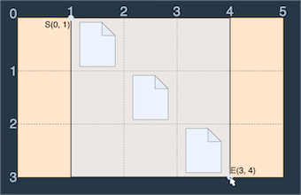
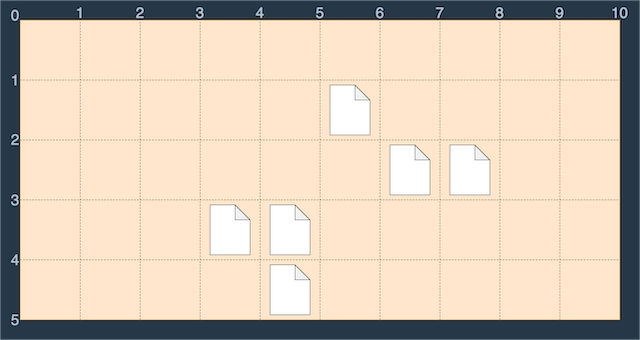
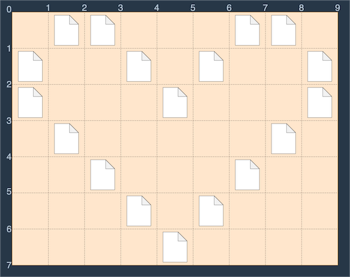
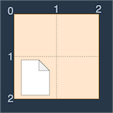

### 🔍 문제 링크
[Level1 **바탕화면 정리** 문제](https://school.programmers.co.kr/learn/courses/30/lessons/161990)

### 📘 문제 설명
코딩테스트를 준비하는 머쓱이는 프로그래머스에서 문제를 풀고 나중에 다시 코드를 보면서 공부하려고 작성한 코드를 컴퓨터 바탕화면에 아무 위치에나 저장해 둡니다. 저장한 코드가 많아지면서 머쓱이는 본인의 컴퓨터 바탕화면이 너무 지저분하다고 생각했습니다. 프로그래머스에서 작성했던 코드는 그 문제에 가서 다시 볼 수 있기 때문에 저장해 둔 파일들을 전부 삭제하기로 했습니다.

컴퓨터 바탕화면은 각 칸이 정사각형인 격자판입니다. 이때 컴퓨터 바탕화면의 상태를 나타낸 문자열 배열 `wallpaper`가 주어집니다. 파일들은 바탕화면의 격자칸에 위치하고 바탕화면의 격자점들은 바탕화면의 가장 왼쪽 위를 (0, 0)으로 시작해 (세로 좌표, 가로 좌표)로 표현합니다. 빈칸은 ".", 파일이 있는 칸은 "#"의 값을 가집니다. 드래그를 하면 파일들을 선택할 수 있고, 선택된 파일들을 삭제할 수 있습니다. 머쓱이는 최소한의 이동거리를 갖는 한 번의 드래그로 모든 파일을 선택해서 한 번에 지우려고 하며 드래그로 파일들을 선택하는 방법은 다음과 같습니다.

- 드래그는 바탕화면의 격자점 S(`lux`, `luy`)를 마우스 왼쪽 버튼으로 클릭한 상태로 격자점 E(`rdx`, `rdy`)로 이동한 뒤 마우스 왼쪽 버튼을 떼는 행동입니다. 이때, **"점 S에서 점 E로 드래그한다"**고 표현하고 점 S와 점 E를 각각 드래그의 시작점, 끝점이라고 표현합니다.
- 점 S(`lux`, `luy`)에서 점 E(`rdx`, `rdy`)로 드래그를 할 때, "드래그 한 거리"는 |`rdx` - `lux`| + |`rdy` - `luy`|로 정의합니다.
- 점 S에서 점 E로 드래그를 하면 바탕화면에서 두 격자점을 각각 왼쪽 위, 오른쪽 아래로 하는 직사각형 내부에 있는 모든 파일이 선택됩니다.

예를 들어 `wallpaper` = [".#...", "..#..", "...#."]인 바탕화면을 그림으로 나타내면 다음과 같습니다.


이러한 바탕화면에서 다음 그림과 같이 S(0, 1)에서 E(3, 4)로 드래그하면 세 개의 파일이 모두 선택되므로 드래그 한 거리 (3 - 0) + (4 - 1) = 6을 최솟값으로 모든 파일을 선택 가능합니다.



(0, 0)에서 (3, 5)로 드래그해도 모든 파일을 선택할 수 있지만 이때 드래그 한 거리는 (3 - 0) + (5 - 0) = 8이고 이전의 방법보다 거리가 늘어납니다.

머쓱이의 컴퓨터 바탕화면의 상태를 나타내는 문자열 배열 `wallpaper`가 매개변수로 주어질 때 바탕화면의 파일들을 한 번에 삭제하기 위해 최소한의 이동거리를 갖는 드래그의 시작점과 끝점을 담은 정수 배열을 return하는 `solution` 함수를 작성해 주세요. 드래그의 시작점이 (`lux`, `luy`), 끝점이 (`rdx`, `rdy`)라면 정수 배열 [`lux`, `luy`, `rdx`, `rdy`]를 return하면 됩니다.

### 📕 제한사항
- 1 ≤ wallpaper의 길이 ≤ 50
- 1 ≤ wallpaper[i]의 길이 ≤ 50
  - wallpaper의 모든 원소의 길이는 동일합니다.
- wallpaper[i][j]는 바탕화면에서 i + 1행 j + 1열에 해당하는 칸의 상태를 나타냅니다.
- wallpaper[i][j]는 "#" 또는 "."의 값만 가집니다.
- 바탕화면에는 적어도 하나의 파일이 있습니다.
- 드래그 시작점 (lux, luy)와 끝점 (rdx, rdy)는 lux < rdx, luy < rdy를 만족해야 합니다.

### 📙 입출력 예
|wallpaper|result|
|:--|:---|
|[".#...", "..#..", "...#."]|[0, 1, 3, 4]|
|["..........", ".....#....", "......##..", "...##.....", "....#....."]|[1, 3, 5, 8]|
|[".##...##.", "#..#.#..#", "#...#...#", ".#.....#.", "..#...#..", "...#.#...", "....#...."]|[0, 0, 7, 9]|
|["..", "#."]|[1, 0, 2, 1]|

### 📒 입출력 예 설명
**입출력 예 #1**  
문제 설명의 예시와 같은 예제입니다. (0, 1)에서 (3, 4)로 드래그 하면 모든 파일을 선택할 수 있고 드래그 한 거리는 6이었고, 6보다 적은 거리로 모든 파일을 선택하는 방법은 없습니다. 따라서 [0, 1, 3, 4]를 return합니다.

**입출력 예 #2**  
예제 2번의 바탕화면은 다음과 같습니다.



(1, 3)에서 (5, 8)로 드래그하면 모든 파일을 선택할 수 있고 이보다 적은 이동거리로 모든 파일을 선택하는 방법은 없습니다. 따라서 가장 적은 이동의 드래그로 모든 파일을 선택하는 방법인 [1, 3, 5, 8]을 return합니다.

**입출력 예 #3**  
예제 3번의 바탕화면은 다음과 같습니다.



모든 파일을 선택하기 위해선 바탕화면의 가장 왼쪽 위 (0, 0)에서 가장 오른쪽 아래 (7, 9)로 드래그 해야만 합니다. 따라서 [0, 0, 7, 9]를 return합니다.

**입출력 예 #4**  
예제 4번의 바탕화면은 다음과 같이 2행 1열에만 아이콘이 있습니다.



이를 드래그로 선택하기 위해서는 그 칸의 왼쪽 위 (1, 0)에서 오른쪽 아래 (2, 1)로 드래그 하면 됩니다. (1, 0)에서 (2, 2)로 드래그 해도 아이콘을 선택할 수 있지만 이전보다 이동거리가 늘어납니다. 따라서 [1, 0, 2, 1]을 return합니다.

### 📔 나의 알고리즘 순서
1. `wallpaper`를 순회하며 파일이 존재하는가 확인한다.
2. 파일이 존재하면, 해당 파일을 포함할 수 있도록 점 S와 점 E의 범위를 수정한다.

### ✅ 나의 해답코드
```javascript
function solution(wallpaper) {
    let [lux, luy] = [wallpaper.length, wallpaper[0].length];
    let [rdx, rdy] = [0, 0];
    
    wallpaper.forEach((row, xpos) => {
        [...row].forEach((data, ypos) => {
          if(data === '#') {
              if(lux > xpos) lux = xpos;
              if(luy > ypos) luy = ypos;
              if(rdx <= xpos) rdx = xpos + 1;
              if(rdy <= ypos) rdy = ypos + 1;
          }
        });
    });
    
    return [lux, luy, rdx, rdy];
}
```

### ✨ 깔끔한 해답코드
```javascript
// 최대, 최소값을 찾는 것이라 중복된 x좌표, y좌표가 들어가도 상관없다.
// 중복 좌표값이 신경쓰이면 Set 객체를 이용하는 방법이나,
// Array.prototype.includes를 이용하여 원하는 내용만 추가하는 방법도 있겠다.
function solution(wallpaper) {
    const x = [];
    const y = [];
    
    wallpaper.forEach((row, xpos) => {
        [...row].forEach((data, ypos) => {
          if(data === '#') {
              x.push(xpos);
              y.push(ypos);
          }
        });
    });
    
    return [Math.min(...x), Math.min(...y), Math.max(...x) + 1, Math.max(...y) + 1];
}
```
어차피 x, y 좌표계의 최솟값과 최댓값을 통해 드래그 영역을 지정하면 되기 때문에, 매번 좌표를 비교해서 lux, luy, rdx, rdy를 움직이기보다 나올 수 있는 모든 좌표를 모아서 최솟값과 최댓값을 구하면 된다.

### 🤔고민한점 & 💡배운점
1\) 🤔 x축과 y축을 기존의 수학적 좌표계의 고정관념(가로: x축, 세로: y축)으로 사고하였고, 이 때문에 문제 풀이시 방해가 되었다.

수학적 좌표계로 바라보면, 예제 1번은 `(lux, luy)`는 `(1, 0)`이어야 하는데, 문제를 읽어보면 `(0, 1)`이라고 설명을 한다. 문제는 단순히 `(lux, luy)`를 `(row, col)`이라는 관점으로 바라본 것 같다. 

좌표축은 축에 의미를 정하고, 바라보는 방법에 따라 달라질 수 있는데 너무 딱딱하게 사고한 것 같다.

2\) 💡예전 `Level1 공원산책` 문제를 풀이할 때와 유사한 실수를 다시 확인할 수 있었다. 매회 검사가 필요한 것인지, 아니면 일단 나올 수 있는 케이스를 모두 구하고, 그 케이스 모음 안에서 한 번의 검사로 결과를 도출할 수 있는지 좀 더 세밀하게 사고하는 연습이 필요하다.