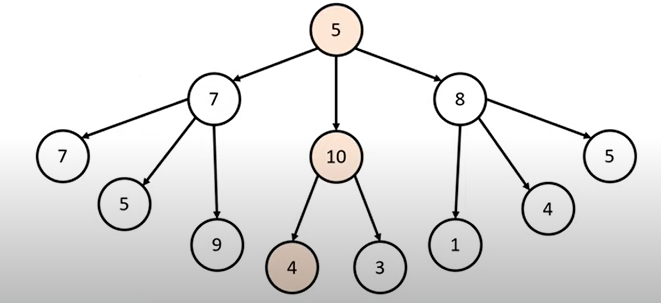
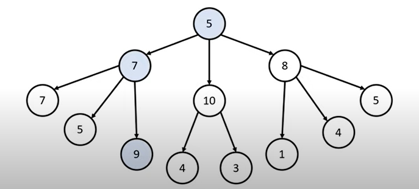

### 🔍 문제 링크
[Level1 **체육복** 문제](https://school.programmers.co.kr/learn/courses/30/lessons/42862)

### 📘 문제 설명
점심시간에 도둑이 들어, 일부 학생이 체육복을 도난당했습니다. 다행히 여벌 체육복이 있는 학생이 이들에게 체육복을 빌려주려 합니다. 학생들의 번호는 체격 순으로 매겨져 있어, 바로 앞번호의 학생이나 바로 뒷번호의 학생에게만 체육복을 빌려줄 수 있습니다. 예를 들어, 4번 학생은 3번 학생이나 5번 학생에게만 체육복을 빌려줄 수 있습니다. 체육복이 없으면 수업을 들을 수 없기 때문에 체육복을 적절히 빌려 최대한 많은 학생이 체육수업을 들어야 합니다.

전체 학생의 수 n, 체육복을 도난당한 학생들의 번호가 담긴 배열 lost, 여벌의 체육복을 가져온 학생들의 번호가 담긴 배열 reserve가 매개변수로 주어질 때, 체육수업을 들을 수 있는 학생의 최댓값을 return 하도록 solution 함수를 작성해주세요.

### 📕 제한사항
- 전체 학생의 수는 2명 이상 30명 이하입니다.
- 체육복을 도난당한 학생의 수는 1명 이상 n명 이하이고 중복되는 번호는 없습니다.
- 여벌의 체육복을 가져온 학생의 수는 1명 이상 n명 이하이고 중복되는 번호는 없습니다.
- 여벌 체육복이 있는 학생만 다른 학생에게 체육복을 빌려줄 수 있습니다.
- 여벌 체육복을 가져온 학생이 체육복을 도난당했을 수 있습니다. 이때 이 학생은 체육복을 하나만
- 도난당했다고 가정하며, 남은 체육복이 하나이기에 다른 학생에게는 체육복을 빌려줄 수 없습니다.
  
### 📙 입출력 예
|n|lost|reserve|return|
|:---|:---|:---|:---|
|5|[2, 4]|[1, 3, 5]|5|
|5|[2, 4]|[3]|4|
|3|[3]|[1]|2|

### 📒 입출력 예 설명
**예제 #1**  
1번 학생이 2번 학생에게 체육복을 빌려주고, 3번 학생이나 5번 학생이 4번 학생에게 체육복을 빌려주면 학생 5명이 체육수업을 들을 수 있습니다.

**예제 #2**  
3번 학생이 2번 학생이나 4번 학생에게 체육복을 빌려주면 학생 4명이 체육수업을 들을 수 있습니다.

### 📔 나의 알고리즘 순서
1. 모든 학생들이 기본적으로 체육복을 1개씩 가지고 있도록 초기화한다.
2. `lost` 배열을 통해 체육복을 도둑 맞은 학생들의 체육복을 1개 감소시킨다.
3. `reserve` 배열을 통해 체육복에 여분이 있는 학생들은 체육복을 1개 증가시킨다.
4. 학생 한명씩 순차적으로 검사를 진행하며, 체육복이 있는지 확인한다.  
  4-1. 체육복이 없다면, 앞 or 뒤 학생이 여유가 있는지 확인하여 빌린다.  
  4-2. 체육복이 있다면, 다음 학생을 확인한다.

### ✅ 나의 해답코드
```javascript
function solution(n, lost, reserve) {
  const students = Array(n).fill(1);

  lost.forEach((target) => (students[target - 1] -= 1));
  reserve.forEach((target) => (students[target - 1] += 1));

  students.forEach((cloth, idx) => {
    if (cloth === 0) {
      if (students[idx - 1] >= 2) {
        students[idx - 1] -= 1;
        students[idx] += 1;
      } else if (students[idx + 1] >= 2) {
        students[idx + 1] -= 1;
        students[idx] += 1;
      }
    }
  });

  return students.filter((cloth) => cloth > 0).length;
}
```


### 📝고민한점 & 💡배운점
**1\) 🤔 Greedy 알고리즘 문제로 분류되어 있어서 매순간의 최선의 선택을 통해 문제를 해결했지만, 문제만 바라보았을 때 그리디 알고리즘을 사용해도 되는지 아직 잘 모르겠다.**

그리디 알고리즘은 직관적인 방법이지만 항상 최적해를 보장해주는 것은 아니다. 대표적인 예시는 아래와 같다.  
최대 길이를 가지는 경로를 탐색하는 문제가 있다고 가정해보자.



그리디 알고리즘으로 접근한다면, 매순간 최선의 선택을 진행하게 되며 위와 같은 결과가 나올 것이다. (`5 + 10 + 4 = 19`)



하지만 실제의 최적해는 위의 그림과 같이 탐색해야한다. (`5 + 7 + 9 = 21`)

**그렇다면 그리디 알고리즘은 왜 사용하는 것일까?**  
① 매순간의 최적해를 구하는 알고리즘은 상대적으로 구현하기 쉽다.  
② 모든 케이스에 그런 것은 아니지만 보통의 다른 알고리즘에 비해 성능이 좋다.

**그리디 알고리즘이 적합한지 평가하기 위한 조건 (정당성)**  
① 탐욕적 선택 속성(Greedy Choice Property)  
각 단계에서의 선택이 해당 단계의 최적해일 것이며, 이러한 선택들이 최적해를 보장한다는 것으로 각 선택이 지역적으로 최적이며, 이는 전역적으로 최적해에 기여한다는 것을 보여줘야한다.

② 최적 부분구조 (optimal substructure)
문제의 최적해가 부분 문제의 최적해로 구성되는 성질을 말하며, 그리디 알고리즘을 적용할 때, 각 단계에서의 선택은 부분 문제의 최적해로 이어져야 한다. 이를 통해 그리디 알고리즘이 전체 문제의 최적해를 구성할 수 있는지를 확인할 수 있다.

**그리디 알고리즘을 사용하는 경우**  
① 지역 최적해가 전역 최적해와 동일한 경우  
일부 문제에서는 각 단계에서 탐욕적인 선택이 최적해를 보장하는 경우가 있다. 대표적으로 거스롬돈의 가장 큰 단위 동전부터 선택하는 문제가 있다.

② 최적해 대신 근사해로 충분한 경우  
모든 경우의 수를 고려하는 알고리즘은 계산 비용이 매우 크고 시간이 오래 걸릴 수 있다. 이럴 때는 그리디 알고리즘을 사용하여 계산 비용을 줄이고, 근사적인 최적해를 빠르게 얻을 수 있다.

③ 최적해를 구하는 정확한 알고리즘이 알려지지 않은 경우  
일부 문제에서는 최적해룰 구하는 정확한 알고리즘이 알려지지 않거나, 현재 상황에서 최적해를 보장하는 다른 알고리즘이 복잡하거나 비현실적인 경우가 있을 수 있다. 이럴 때 근사적인 최적해를 얻을 때 사용한다.

④ 최적해를 찾기 위해 모든 경우의 수를 탐색하는 것이 불가능한 경우  
일부 문제는 가능한 모든 경우의 수를 고려하여 최적해를 찾는 것이 계산적으로 현실적이지 않을 수 있다. 이경우 그리드 알고리즘은 빠른 실행 속도를 가지며, 근사적인 최적해를 제공할 수 있다.

### 🔍참고 내용
※ 1. [Programiz: Greedy Algorithm](https://www.programiz.com/dsa/greedy-algorithm)  
※ 2. [그리디 알고리즘과](https://yganalyst.github.io/concept/algo_cc_book_1/)  
※ 3. [이것이 코딩 테스트다: 그리디 알고리즘과 예제](https://velog.io/@cha-suyeon/%EC%95%8C%EA%B3%A0%EB%A6%AC%EC%A6%98-%EA%B7%B8%EB%A6%AC%EB%94%94Greedy-%EC%95%8C%EA%B3%A0%EB%A6%AC%EC%A6%98%EA%B3%BC-%EC%98%88%EC%A0%9C-%ED%8C%8C%EC%9D%B4%EC%8D%AC)