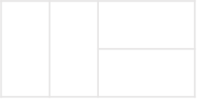
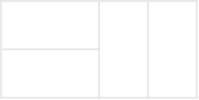

### 🔍 문제 링크
[Level2 **2xn 타일링** 문제](https://school.programmers.co.kr/learn/courses/30/lessons/12900)

### 📘 문제 설명
가로 길이가 2이고 세로의 길이가 1인 직사각형모양의 타일이 있습니다. 이 직사각형 타일을 이용하여 세로의 길이가 2이고 가로의 길이가 n인 바닥을 가득 채우려고 합니다. 타일을 채울 때는 다음과 같이 2가지 방법이 있습니다.

- 타일을 가로로 배치 하는 경우
- 타일을 세로로 배치 하는 경우
- 
예를들어서 n이 7인 직사각형은 다음과 같이 채울 수 있습니다.


직사각형의 가로의 길이 n이 매개변수로 주어질 때, 이 직사각형을 채우는 방법의 수를 return 하는 solution 함수를 완성해주세요.

### 📕 제한사항
- 가로의 길이 n은 60,000이하의 자연수 입니다.
- 경우의 수가 많아 질 수 있으므로, 경우의 수를 1,000,000,007으로 나눈 나머지를 return해주세요.

### 📙 입출력 예
|n|result|
|:---|:---|
|4|5|

### 📒 입출력 예 설명
**입출력 예 #1**
다음과 같이 5가지 방법이 있다.

  
  
  
  


### 📔 나의 알고리즘 순서
1. 타일의 종류가 2가지이므로, n을 2로 나누어 몫의 개수를 구한다. (n = 5, 2^2+1 => 몫은 2)
2. 몫을 0부터 최댓값까지의 경우의 수를 조합으로 구하여 합산한다. (n = 5, 2는 0~2개 가능)

### ✅ 나의 해답코드
```javascript
// ❌ 정확성은 통과하나, 효율성을 통과하지 못한 코드...
function solution(n) {
  let count = 0n;

  const memo = {};
  const factorial = (num) => {
    if (num < 1) return 1n;
    const saved = memo[num - 1] || factorial(num - 1);
    const result = BigInt(num) * BigInt(saved);
    memo[num] = result;
    return result;
  };

  const combination = (n, r) => {
    return factorial(n) / (factorial(n - r) * factorial(r));
  };

  for (let share = 0; share <= Math.floor(n / 2); share++) {
    const remainder = n - 2 * share;
    const cases = combination(share + remainder, share);
    count = (count + cases) % 1000000007n;
  }
  return count;
}
```

### ✨ 깔끔한 해답코드
```javascript
function solution(n) {
  const dp = [1, 1];
  for (let i = 2; i <= n; i++) {
    dp[i] = (dp[i - 1] + dp[i - 2]) % 1000000007;
  }
  return dp[n];
}
```

### 🤔고민한점 & 💡배운점
1\) 🤔 문제를 읽고 바로 조합으로 풀 수 있다고 생각했다. 이때 가로의 길이가 60,000 이하라는 것을 곰곰히 생각해봤어야 했지만, 이미 마음으로 조합이면 끝난다는 생각에 갇혀있었다. 2x1 타일을 가로로 사용할 것인가 세로로 사용할 것인가 2가지의 경우의 수를 바탕으로 풀이를 진행했다. 

n의 길이를 2로 나눠서 나온 몫을 바탕으로 0~몫까지의 경우의 수를 더하는 방법을 사용했다.

```
n = 5
n = 2*2 + 1 

최대 몫은 2이므로 0~2범위로 길이가 2인 타일을 사용할 수 있다.

길이 1타일 5개, 길이 2타일 0개 = 5C0
길이 1타일 3개, 길이 2타일 1개 = 4C1
길이 1타일 1개, 길이 2타일 2개 = 3C2

경우의 수: 5C0 + 4C1 + 3C2 = 8
```

위와 같은 생각으로 조합 공식을 사용하여 풀이한 코드가 현재 나의 해답코드에 있는 풀이다. 문제 정확성은 맞더라도 효율성을 통과하지 못한다.

이후에 팩토리얼 부분을 메모이제이션을 이용하면 빠르게 가능하지 않을까란 생각을 했고, 시도했지만, 저장되는 정수의 범위가 너무 커서 컴파일 에러가 일어나는 문제가 발생했다.

2\) 💡다른 사람의 풀이를 보니, 전형적인 DP 문제였음을 알게 되었다. 길이 n의 증가에 따라 피보나치 수열처럼 경우의 수가 증가했다. 사실 피보나치처럼 증가한다는 것은 실제로 몇개씩 증가하는지 확인하지 않았다면 몰랐을 것 같다. 문제를 단순하게 머리로만 생각히자 말고 손으로 그려보거나 증가 폭을 생각해보는 것도 중요한 것 같다. 

아직 문제의 풀이에 DP 알고리즘임을 빠르게 캐치하는 능력이 부족한 것 같다. 전형적인 유형으로 정리하고, 다음에 다시 풀어봐야겠다.