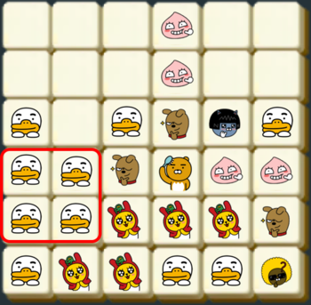

### 🔍 문제 링크
[Level2 **\[1차\] 프렌즈 4블록** 문제](https://school.programmers.co.kr/learn/courses/30/lessons/17679)

### 📘 문제 설명
블라인드 공채를 통과한 신입 사원 라이언은 신규 게임 개발 업무를 맡게 되었다. 이번에 출시할 게임 제목은 "프렌즈4블록". 같은 모양의 카카오프렌즈 블록이 2×2 형태로 4개가 붙어있을 경우 사라지면서 점수를 얻는 게임이다.


만약 판이 위와 같이 주어질 경우, 라이언이 2×2로 배치된 7개 블록과 콘이 2×2로 배치된 4개 블록이 지워진다. 같은 블록은 여러 2×2에 포함될 수 있으며, 지워지는 조건에 만족하는 2×2 모양이 여러 개 있다면 한꺼번에 지워진다.


블록이 지워진 후에 위에 있는 블록이 아래로 떨어져 빈 공간을 채우게 된다.



만약 빈 공간을 채운 후에 다시 2×2 형태로 같은 모양의 블록이 모이면 다시 지워지고 떨어지고를 반복하게 된다.


위 초기 배치를 문자로 표시하면 아래와 같다.

```
TTTANT
RRFACC
RRRFCC
TRRRAA
TTMMMF
TMMTTJ
```

각 문자는 라이언(R), 무지(M), 어피치(A), 프로도(F), 네오(N), 튜브(T), 제이지(J), 콘(C)을 의미한다

입력으로 블록의 첫 배치가 주어졌을 때, 지워지는 블록은 모두 몇 개인지 판단하는 프로그램을 제작하라.


### 📕 제한사항
- 입력으로 판의 높이 `m`, 폭 `n`과 판의 배치 정보 `board`가 들어온다.
- 2 ≦ `n`, `m` ≦ 30
- `board`는 길이 `n`인 문자열 `m`개의 배열로 주어진다. 블록을 나타내는 문자는 대문자 A에서 Z가 사용된다.

### 📙 입출력 예
|m|n|board|answer|
|:---|:---|:---|:---|
|4|5|["CCBDE", "AAADE", "AAABF", "CCBBF"]|14|
|6|6|["TTTANT", "RRFACC", "RRRFCC", "TRRRAA", "TTMMMF", "TMMTTJ"]|15|

### 📒 입출력 예 설명
- 입출력 예제 1의 경우, 첫 번째에는 A 블록 6개가 지워지고, 두 번째에는 B 블록 4개와 C 블록 4개가 지워져, 모두 14개의 블록이 지워진다.
- 입출력 예제 2는 본문 설명에 있는 그림을 옮긴 것이다. 11개와 4개의 블록이 차례로 지워지며, 모두 15개의 블록이 지워진다.


### 📔 나의 알고리즘 순서
1. 행과 열을 바꿔서 뒤집는다. (이후 삭제시 압축을 편하게 하기 위해서)
2. 각 좌표를 기준으로 2x2가 성립하는지 확인한다.  
  2-1. 성립되면, 삭제 대상으로 분류한다.  
  2-2. 안되면, 다음 좌표를 확인한다.  
3. 모든 좌표 확인이 끝날 때까지 2번을 반복한다.
4. 삭제 대상을 제거하고, 압축한다. + 삭제된 개수를 기록한다.
5. 삭제 대상이 안나올 때까지 2~4를 반복한다.

### ✅ 나의 해답코드
```javascript
function solution(m, n, board) {
  const BLOCK_LIST = [
    [0, 0], [0, 4], [1, 0], [1, 1]
  ];
  
  let nboard = Array.from({ length: board[0].length }, () => Array(board.length).fill(''));
  for (let i = 0; i < board.length; i++) {
    for (let j = 0; j < board[0].length; j++) {
      nboard[j][i] = board[i][j];
    }
  }

  let count = 0;
  while (true) {
    const remove = new Set();
    for (let row = 0; row < nboard.length - 1; row++) {
      for (let col = 0; col < nboard[0].length - 1; col++) {
        const block = nboard[row][col];
        if (block === '-') continue;

        const store = [];
        for (let i = [0]; i < BLOCK_LIST.length; i++) {
          const [mr, mc] = BLOCK_LIST[i];
          const [nr, nc] = [row + mr, col + mc];

          const target = nboard[nr][nc];
          if (block !== target) break;
          store.push([nr, nc]);
        }
        if (store.length === 4) store.forEach((pos) => remove.add(pos.join(':')));
      }
    }

    if (remove.size === 0) break;

    count += remove.size;
    for (const pos of remove) {
      const [row, col] = pos.split(':');
      nboard[row][col] = '-';
    }

    nboard = nboard.map((row) => {
      const MAX_ROW = row.length;
      return row.join('').replaceAll('-', '').padStart(MAX_ROW, '-').split('');
    });
  }

  return count;
}
```

### 🤔고민한점 & 💡배운점
1\) 🤔 이번 문제의 핵심 크게 2가지 로직을 처리하는 것이라고 생각했다.
- 첫째, 2x2 형태의 블록을 만족하는 곳을 찾는 것
- 둘째, 2x2 형태를 만족한 블록을 삭제한 뒤 빈 공간만큼 블록을 압축할 것

2x2 형태의 블록을 확인하는 것보다 삭제 후 압축이 더 중요하다고 생각했다. 그림을 통해 압축 방향을 고려하면 col(열)을 기준으로 빈 공간만큼 블록들이 이동하여 압축한다. 일반적으로 2차원 배열은 row(행)을 먼저 접근하고, 이후 col(열)에 접근한다. 때문에 열을 기준으로 움직이는 것은 상대적으로 고려해야할 점이 더 많다. 하지만 행과 열을 뒤집으면, row(행)에만 접근하여 압축할 수가 있어 상대적으로 편하게 블록을 이동할 수 있다.그래서 2x2블록을 탐색하기에 앞서 행과 열을 뒤집었다. 이후에 2x2형태를 만족하지 않을 때까지 각 좌표를 기준으로 확인을 진행하도록 만들었다.