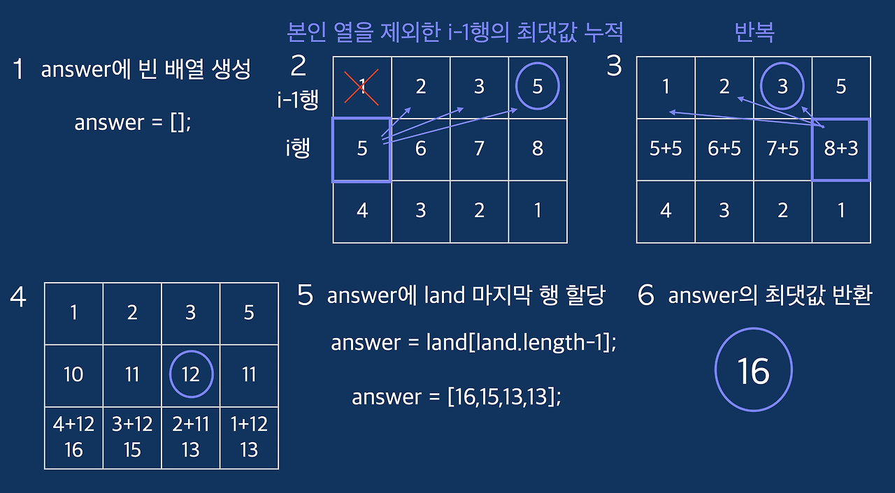

### 🔍 문제 링크
[Level2 **땅따먹기** 문제](https://school.programmers.co.kr/learn/courses/30/lessons/12913#)

### 📘 문제 설명
땅따먹기 게임을 하려고 합니다. 땅따먹기 게임의 땅(land)은 총 N행 4열로 이루어져 있고, 모든 칸에는 점수가 쓰여 있습니다. 1행부터 땅을 밟으며 한 행씩 내려올 때, 각 행의 4칸 중 한 칸만 밟으면서 내려와야 합니다. 단, 땅따먹기 게임에는 한 행씩 내려올 때, 같은 열을 연속해서 밟을 수 없는 특수 규칙이 있습니다.

예를 들면,

| 1 | 2 | 3 | 5 |  
| 5 | 6 | 7 | 8 |  
| 4 | 3 | 2 | 1 |

로 땅이 주어졌다면, 1행에서 네번째 칸 (5)를 밟았으면, 2행의 네번째 칸 (8)은 밟을 수 없습니다.

마지막 행까지 모두 내려왔을 때, 얻을 수 있는 점수의 최대값을 return하는 solution 함수를 완성해 주세요. 위 예의 경우, 1행의 네번째 칸 (5), 2행의 세번째 칸 (7), 3행의 첫번째 칸 (4) 땅을 밟아 16점이 최고점이 되므로 16을 return 하면 됩니다.

### 📕 제한사항
- 행의 개수 N : 100,000 이하의 자연수
- 열의 개수는 4개이고, 땅(land)은 2차원 배열로 주어집니다.
- 점수 : 100 이하의 자연수

### 📙 입출력 예
|land|answer|
|:---|:---|
|[[1,2,3,5],[5,6,7,8],[4,3,2,1]]|16|

### 📒 입출력 예 설명
**입출력 예 #1**  
문제의 예시와 같습니다.

### 📔 나의 알고리즘 순서
1. 누적합을 기록하는 배열의 값을 순차적으로 하나 가져온다.
2. 누적합의 현재 열(= 인덱스)을 제외한 나머지 숫자들의 목록을 구한다.
3. 나머지 숫자들중 최대값을 구하여 현재 열의 누적값과 합산하여 기록한다.
4. 누적합의 배열의 모든 요소에 대해 1~3을 진행한다.
5. land의 행이 끝날 때까지 1~4를 반복한다.


### ✅ 나의 해답코드
```javascript
function solution(land) {
  const COLUMN_LENGTH = 4;

  const sum = land.reduce((acc, cur) => {
    return cur.map((value, curIdx) => {
      const filtered = acc.filter((_, accIdx) => curIdx !== accIdx);
      const max = Math.max(...filtered);
      return value + max;
    });
  }, Array(COLUMN_LENGTH).fill(0));

  return Math.max(...sum);
}
```

### 🤔고민한점 & 💡배운점
1\) 🤔 문제를 읽으면서, 어떻게 해야 최대값을 찾을 수 있을까 고민되었다. dfs/bfs처럼 완전 탐색을 진행하면 가능하겠지만, 행의 최대 개수가 10만이라 모든 경우를 탐색하는 것은 연산 효율이 좋지 않을 것 같았다. 그럼 백트래킹처럼 유망함수를 작성하여 중간에 돌아가는건 어떨까 싶었지만, 딱히 어떤 조건으로 돌아가야할지 정의할 수가 없었다. 

그래서 생각한 것이 dfs처럼 풀되, 내가 현재 선택한 열을 제외한 나머지중 최대값을 선택하여 끝까지 들어가는 방법이었다. 일종의 그리디 알고리즘을 생각했다. 결론부터 말하자면, 위에서 아래로 내려가며 최대값을 선택하는 것은 결과적으로 최선의 선택이 아니다.

반례  
| 1 | 1 | 3 | 4 |  
| 1 | 1 | 3 | 5 |  

위와 같이 있다면, 1행에서 4를 선택하고 2행에서 3을 선택하여 값이 7이 되지만, 사실 1행에서 3을 선택하고 2행에서 5를 선택하면 8이 되어 더 큰수가 된다. 이는 그리디 알고리즘으로 풀 수 없는 반례이다. 결과적으로 그리디 알고리즘으로는 풀이할 수 없었다.

2\) 💡 결국 다른 사람의 풀이를 참고하여 문제의 어느 부분에서 힌트를 얻고, 어떤 알고리즘을 생각했는지 참고했다. 이번 문제는 이전까지의 최적 부분 구조가 더 큰 문제를 해결해주는 DP 알고리즘이었다. 생각해보니 땅이 한 칸씩 늘어날 때마다 이전까지의 최적해를 통해 다음의 최적해를 탐색할 수 있었다. 왜 문제를 보며 DP 알고리즘이라고 생각하지 못했을까...



위의 그림은 DP로 문제를 해결하는 과정을 표현한 내용이다. 이때 관점을 유연하게 사고 해야함을 느꼈다. 나는 위에서 아래로 순차적으로 내려가는 것만 생각했다. 하지만 반대로 아래에서 위를 선택하는 방법이 있음을 알게 되었다. 이를 이용하면 이전까지의 최대값을 누적하여 계산할 수 있고, 이를 통해 최적의 해를 선택할 수 있다는 것을 알게 되었다. 답을 알면 간단하지만 문제를 직면하고 해결하는 과정에서는 보이지 않았다. 이번 문제의 경험을 통해 아래에서 이전까지 누적된 수를 선택하는 방법도 고려해봐야겠다.

### 🔍참고 내용
1. [[프로그래머스] 땅따먹기 | JavaScript](https://onlydev.tistory.com/71)
2. [[Programmers Lv.2 | JS] 땅따먹기](https://velog.io/@qhflrnfl4324/Programmers-Lv.2-JS-%EB%95%85%EB%94%B0%EB%A8%B9%EA%B8%B0)