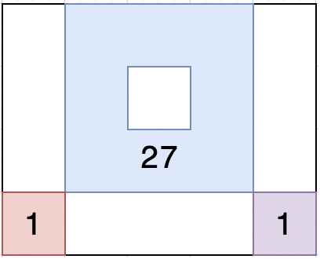

### 🔍 문제 링크
[Level2 **무인도 여행** 문제](https://school.programmers.co.kr/learn/courses/30/lessons/154540)

### 📘 문제 설명
메리는 여름을 맞아 무인도로 여행을 가기 위해 지도를 보고 있습니다. 지도에는 바다와 무인도들에 대한 정보가 표시돼 있습니다. 지도는 1 x 1크기의 사각형들로 이루어진 직사각형 격자 형태이며, 격자의 각 칸에는 'X' 또는 1에서 9 사이의 자연수가 적혀있습니다. 지도의 'X'는 바다를 나타내며, 숫자는 무인도를 나타냅니다. 이때, 상, 하, 좌, 우로 연결되는 땅들은 하나의 무인도를 이룹니다. 지도의 각 칸에 적힌 숫자는 식량을 나타내는데, 상, 하, 좌, 우로 연결되는 칸에 적힌 숫자를 모두 합한 값은 해당 무인도에서 최대 며칠동안 머물 수 있는지를 나타냅니다. 어떤 섬으로 놀러 갈지 못 정한 메리는 우선 각 섬에서 최대 며칠씩 머물 수 있는지 알아본 후 놀러갈 섬을 결정하려 합니다.

지도를 나타내는 문자열 배열 `maps`가 매개변수로 주어질 때, 각 섬에서 최대 며칠씩 머무를 수 있는지 배열에 오름차순으로 담아 return 하는 solution 함수를 완성해주세요. 만약 지낼 수 있는 무인도가 없다면 -1을 배열에 담아 return 해주세요.

### 📕 제한사항
- 3 ≤ `maps`의 길이 ≤ 100
  - 3 ≤ `maps[i]`의 길이 ≤ 100
  - `maps[i]`는 'X' 또는 1 과 9 사이의 자연수로 이루어진 문자열입니다.
  - 지도는 직사각형 형태입니다.

### 📙 입출력 예
|maps|result|
|:---|:---|
|["X591X","X1X5X","X231X", "1XXX1"]|[1, 1, 27]|
|["XXX","XXX","XXX"]|[-1]|

### 📒 입출력 예 설명
**입출력 예 #1**  
위 문자열은 다음과 같은 지도를 나타냅니다.


연결된 땅들의 값을 합치면 다음과 같으며



이를 오름차순으로 정렬하면 [1, 1, 27]이 됩니다.

**입출력 예 #2**  
위 문자열은 다음과 같은 지도를 나타냅니다.


섬이 존재하지 않기 때문에 -1을 배열에 담아 반환합니다.

### 📔 나의 알고리즘 순서
1. 지도와 같은 크기의 방문 배열을 준비한다.
2. 지도의 한 칸씩 접근하여, 방문한 적 있는지, 육지인지 확인한다.  
   2-1. 방문한적 있거나 바다라면, 다음 지도 칸을 확인한다. (2번부터 다시)
3. DFS를 통해 해당 육지의 연결 부위를 모두 구하고, 며칠 머무를 수 있는지 구한다.
4. 모든 지도 칸을 확일할 때까지 2~3를 반복한다.
5. 머무를 수 있는 날짜를 오름차순으로 반환한다.

### ✅ 나의 해답코드
```javascript
function solution(maps) {
  const answer = [];
  const direction = [[1, 0], [-1, 0], [0, 1], [0, -1]];
  const rMaxLen = maps.length;
  const cMaxLen = maps[0].length;
  const visited = Array.from({ length: rMaxLen }, (_, i) => Array(cMaxLen).fill(0));

  const findLand = (r, c) => {
    let days = parseInt(maps[r][c]);
    visited[r][c] = 1;

    for (let i = 0; i < direction.length; i++) {
      const [dr, dc] = direction[i];
      const [nr, nc] = [r + dr, c + dc];

      // 지도 범위를 넘어가는가?
      // 좌표가 바다를 의미하나?
      // 이미 방문한 적이 있는가?
      if (
        0 <= nr && nr < rMaxLen
        && 0 <= nc && nc < cMaxLen
        && maps[nr][nc] !== 'X'
        && !visited[nr][nc]
      ) {
        days += findLand(nr, nc);
      }
    }
    return days;
  };

  for (let row = 0; row < rMaxLen; row++) {
    for (let col = 0; col < cMaxLen; col++) {
      if (visited[row][col] || maps[row][col] === 'X') continue;
      const days = findLand(row, col);
      answer.push(days);
    }
  }

  return answer.length ? answer.sort((a, b) => a - b) : [-1];
}
```

### 🤔고민한점 & 💡배운점
1\) 🤔 문제를 읽고, 전형적인 완전 탐색 문제라고 생각했다. 지도를 한 칸씩 순차적으로 접근하고, 무인도 땅을 밟는 순간부터 연결된 무인도의 크기를 탐색하면 되기 때문이었다. 완전 탐색에 사용할 알고리즘으로 DFS와 BFS 중 DFS를 활용하여 풀이를 진행했다.

매 위치에서 4가지 방향(상, 하, 좌, 우)으로 움직여야함으로, 좌표 이동을 위한 오프셋 배열을 준비했다. 새로운 위치에 도달할 때마다 오프셋 배열을 통해 나아갈 방향을 설정하여 탐색을 진행했다.