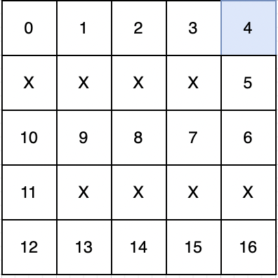
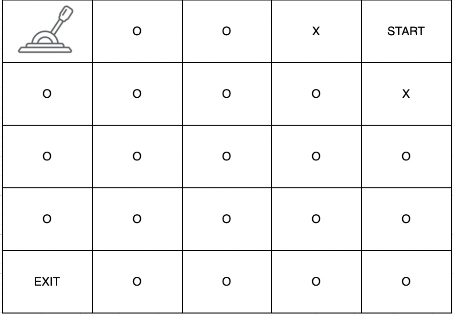

### 🔍 문제 링크
[Level2 **미로 탈출** 문제](https://school.programmers.co.kr/learn/courses/30/lessons/159993)

### 📘 문제 설명
1 x 1 크기의 칸들로 이루어진 직사각형 격자 형태의 미로에서 탈출하려고 합니다. 각 칸은 통로 또는 벽으로 구성되어 있으며, 벽으로 된 칸은 지나갈 수 없고 통로로 된 칸으로만 이동할 수 있습니다. 통로들 중 한 칸에는 미로를 빠져나가는 문이 있는데, 이 문은 레버를 당겨서만 열 수 있습니다. 레버 또한 통로들 중 한 칸에 있습니다. 따라서, 출발 지점에서 먼저 레버가 있는 칸으로 이동하여 레버를 당긴 후 미로를 빠져나가는 문이 있는 칸으로 이동하면 됩니다. 이때 아직 레버를 당기지 않았더라도 출구가 있는 칸을 지나갈 수 있습니다. 미로에서 한 칸을 이동하는데 1초가 걸린다고 할 때, 최대한 빠르게 미로를 빠져나가는데 걸리는 시간을 구하려 합니다.

미로를 나타낸 문자열 배열 `maps`가 매개변수로 주어질 때, 미로를 탈출하는데 필요한 최소 시간을 return 하는 solution 함수를 완성해주세요. 만약, 탈출할 수 없다면 -1을 return 해주세요.

### 📕 제한사항
- 5 ≤ `maps`의 길이 ≤ 100
  - 5 ≤ `maps[i]`의 길이 ≤ 100
  - `maps[i]`는 다음 5개의 문자들로만 이루어져 있습니다.
    - S : 시작 지점
    - E : 출구
    - L : 레버
    - O : 통로
    - X : 벽
  - 시작 지점과 출구, 레버는 항상 다른 곳에 존재하며 한 개씩만 존재합니다.
  - 출구는 레버가 당겨지지 않아도 지나갈 수 있으며, 모든 통로, 출구, 레버, 시작점은 여러 번 지나갈 수 있습니다.

### 📙 입출력 예
|maps|result|
|:---|:---|
|["SOOOL","XXXXO","OOOOO","OXXXX","OOOOE"]|16|
|["LOOXS","OOOOX","OOOOO","OOOOO","EOOOO"]|-1|

### 📒 입출력 예 설명
**입출력 예 #1**  
주어진 문자열은 다음과 같은 미로이며


다음과 같이 이동하면 가장 빠른 시간에 탈출할 수 있습니다.



4번 이동하여 레버를 당기고 출구까지 이동하면 총 16초의 시간이 걸립니다. 따라서 16을 반환합니다.

**입출력 예 #2**  
주어진 문자열은 다음과 같은 미로입니다.



시작 지점에서 이동할 수 있는 공간이 없어서 탈출할 수 없습니다. 따라서 -1을 반환합니다.

### 📔 나의 알고리즘 순서
1. 방문 여부 기록을 위한 2차원 배열을 초기화한다.
2. 시작지점(S), 출구(E), 레버(L) 등 특수 표시의 위치를 별도로 기록한다.
3. 시작 위치부터 레버까지의 최단 거리를 구한다.
4. 레버부터 탈출 위치까지의 최단 거리를 구한다.
5. 3번과 4번의 최단거리를 합쳐서 반환한다.

### ✅ 나의 해답코드
```javascript
function solution(maps) {
    const DIRECTION = [[-1, 0], [1, 0], [0, -1], [0, 1]];
    const MAX_ROW = maps.length;
    const MAX_COL = maps[0].length;

    const signs = {};
    const visited = [];
    for(let row = 0; row < MAX_ROW; row++) {
        visited.push([]);
        for(let col = 0; col < MAX_COL; col++) {
            const sign = maps[row][col];
            
            if(sign === 'X') visited[row][col] = 1;
            else visited[row][col] = 0;
            
            if(sign === 'S' || sign === 'E' || sign === 'L') signs[sign] = [row, col];
        }
    }
    
    function bfs(start, end, v) {
        const [sr, sc] = start;
        const [er, ec] = end;
        const visited = v.map(r => [...r]);
        visited[sr][sc] = 1;
        
        let time = 0;
        const queue = [start];
        while(queue.length) {
            time++;
            const size = queue.length;
            for(let i = 0; i < size; i++) {
                const [r, c] = queue.shift();
                
                for(let j = 0 ; j < DIRECTION.length; j++) {
                    const [dr, dc] = DIRECTION[j];
                    const [nr, nc] =  [r + dr, c + dc];
                    
                    if(
                        nr < 0 || nr >= MAX_ROW ||
                        nc < 0 || nc >= MAX_COL ||
                        visited[nr][nc] === 1
                    ) continue;
                    
                    if(er === nr && ec === nc) return time;
                    visited[nr][nc] = 1;
                    queue.push([nr, nc]);
                }
            }
        }
        return -1;
    }
        
    const START_TO_LEVER = bfs(signs.S, signs.L, visited);
    if(START_TO_LEVER === -1) return -1;
    
    const LEVER_TO_END = bfs(signs.L, signs.E, visited);
    if(LEVER_TO_END === -1) return -1;
    
    return START_TO_LEVER + LEVER_TO_END;
}
```

### 🤔고민한점 & 💡배운점
1\) 🤔 전형적인 최단거리 문제 중 하나였다. 가중치가 없는 미로의 최단거리는 BFS로 풀이할 수 있다. 문제를 읽으면서 시작위치에서 레버, 레버에서 탈출까지의 최단거리를 구하면 문제가 해결되겠구나 싶었다. BFS의 경우 queue를 이용하여 구현하는 방법을 사용하였다. 미로, 최단거리 대표 BFS 문제를 풀고 싶다면 이 문제를 추천하는게 좋을 것 같다.