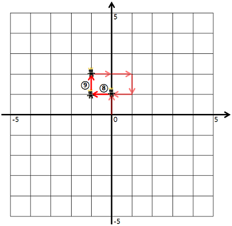

### 🔍 문제 링크
[Level2 **방문 길이** 문제](https://school.programmers.co.kr/learn/courses/30/lessons/49994)

### 📘 문제 설명
게임 캐릭터를 4가지 명령어를 통해 움직이려 합니다. 명령어는 다음과 같습니다.

- U: 위쪽으로 한 칸 가기
- D: 아래쪽으로 한 칸 가기
- R: 오른쪽으로 한 칸 가기
- L: 왼쪽으로 한 칸 가기

캐릭터는 좌표평면의 (0, 0) 위치에서 시작합니다. 좌표평면의 경계는 왼쪽 위(-5, 5), 왼쪽 아래(-5, -5), 오른쪽 위(5, 5), 오른쪽 아래(5, -5)로 이루어져 있습니다.


예를 들어, "ULURRDLLU"로 명령했다면


1번 명령어부터 7번 명령어까지 다음과 같이 움직입니다.


8번 명령어부터 9번 명령어까지 다음과 같이 움직입니다.



이때, 우리는 게임 캐릭터가 지나간 길 중 캐릭터가 처음 걸어본 길의 길이를 구하려고 합니다. 예를 들어 위의 예시에서 게임 캐릭터가 움직인 길이는 9이지만, 캐릭터가 처음 걸어본 길의 길이는 7이 됩니다. (8, 9번 명령어에서 움직인 길은 2, 3번 명령어에서 이미 거쳐 간 길입니다)

단, 좌표평면의 경계를 넘어가는 명령어는 무시합니다.

예를 들어, "LULLLLLLU"로 명령했다면


1번 명령어부터 6번 명령어대로 움직인 후, 7, 8번 명령어는 무시합니다. 다시 9번 명령어대로 움직입니다.


이때 캐릭터가 처음 걸어본 길의 길이는 7이 됩니다.

명령어가 매개변수 dirs로 주어질 때, 게임 캐릭터가 처음 걸어본 길의 길이를 구하여 return 하는 solution 함수를 완성해 주세요.

### 📕 제한사항
- dirs는 string형으로 주어지며, 'U', 'D', 'R', 'L' 이외에 문자는 주어지지 않습니다.
- dirs의 길이는 500 이하의 자연수입니다.

### 📙 입출력 예
|dirs|answer|
|:---|:---|
|"ULURRDLLU"|7|
|"LULLLLLLU"|7|

### 📒 입출력 예 설명
**입출력 예 #1**  
문제의 예시와 같습니다.

**입출력 예 #2**  
문제의 예시와 같습니다.

### 📔 나의 알고리즘 순서
1. dirs에서 지시한 방향을 하나 가져온다.
2. 유효한 명령인지 확인한다. (범위가 넘어가는가)
3. 이전에 방문했는지 확인한다.  
  3-1. 방문했다면, 좌표 이동  
  3-2. 방문하지 않았다면, 좌표이동 + 카운팅  
1. dirs의 모든 지시가 끝날 때까지 1~3을 반복한다.

### ✅ 나의 해답코드
```javascript
function solution(dirs) {
  // 상하좌우 이동 좌표
  const DIRECTION = Object.freeze({ U: [1, 0], D: [-1, 0], L: [0, -1], R: [0, 1] });

  // 역방향 반환 함수
  const findReverse = (direction) => {
    switch (direction) {
      case 'U':
        return 'D';
      case 'D':
        return 'U';
      case 'R':
        return 'L';
      case 'L':
        return 'R';
    }
  };

  // 방향별 방문 여부 확인
  const visited = Array.from({ length: 11 }, () =>
    Array.from({ length: 11 }, () => ({ L: 0, R: 0, U: 0, D: 0 }))
  );

  let count = 0;
  let cur = [5, 5];
  [...dirs].forEach((command) => {
    const [cr, cc] = cur;
    const [mr, mc] = DIRECTION[command];
    const [nr, nc] = [cr + mr, cc + mc];
    const reverse = findReverse(command);

    // 범위를 벗어나는가 확인
    if (0 > nr || nr >= 11 || 0 > nc || nc >= 11) return;

    // 이전에 방문했는가 확인
    if (visited[nr][nc][command] === 0) {
      visited[nr][nc][command] = 1;
      visited[cr][cc][reverse] = 1;
      count++;
    }
    cur = [nr, nc];
  });

  return count;
}

```

### ✨ 깔끔한 해답코드
```javascript
function solution(dirs) {
    let move = { L: [-1, 0], R: [1, 0], U: [0, 1], D: [0, -1] };
    let now = [0, 0];
    let route = new Set();
    
    for (let dir of dirs) {
        let nowX = now[0] + move[dir][0];
        let nowY = now[1] + move[dir][1];
        
        if (nowX > 5 || nowX < -5 || nowY > 5 || nowY < -5) continue;
        
        route.add("" + now[0] + now[1] + nowX + nowY);
        route.add("" + nowX + nowY + now[0] + now[1]);
        
        now = [nowX, nowY];
    }
    
    return route.size / 2;
}
```

### 🤔고민한점 & 💡배운점
1\) 🤔  이번 문제는 지시에 따라 이동하되, 이동 경로가 이전에 사용되었는가 기록하는 부분이 핵심이라고 생각했다. 문제를 읽고 경로를 어떻게 기록할까 고민이 되었다. 같은 좌표로 이동하더라도 상하좌우에서 들어올 수 있었다. 그래서 각 좌표별로 상하좌우 중 어디로 들어왔는지 기록해보는게 어떨까라는 생각을 했다. visited라는 방문 기록을 상하좌우를 별도로 기록하도록 만들었고, 이를 통해 중복 경로를 판단하여 문제를 풀이했다. 문제는 각각의 방향과 좌표를 기록하는 방법은 번거롭고 생각해야할 부분도 많았다. 

추가적으로 좌표의 움직임을 배열로 관리하기 위해 양의 정수로 변경했다. 그래서 좌표상의 음수값을 없앴지만 오히려 (0, 0)이었던 좌표를 옮기거나, 전체 좌표의 범위를 재설정하는 부분이 헷갈리는 문제가 있었다.

2\) 💡이후 다른 사람의 풀이를 확인해보니, **A좌표에서 B좌표로 이동했다는 부분을 문자열로 만들어서 Set에 적용하는 풀이를 보았다.** 생각해보면 중복제거는 Set을 활용하면 편하고, 상하좌우 방향성을 고려하기보다 A좌표에서 B좌표로 이동했음을 규칙으로 정해 문자열로 만들면, 같은 좌표 이동을 구별할 수 있어서 더 쉽게 구현할 수 있음을 알게 되었다. 다음에 좌표 이동을 통해 이동 경로 중복 여부를 판단할 때엔 Set을 활용해봐야겠다.