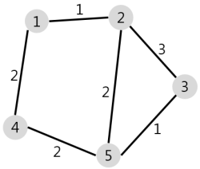

### 🔍 문제 링크
[Level2 **배달** 문제](https://school.programmers.co.kr/learn/courses/30/lessons/12978)

### 📘 문제 설명
N개의 마을로 이루어진 나라가 있습니다. 이 나라의 각 마을에는 1부터 N까지의 번호가 각각 하나씩 부여되어 있습니다. 각 마을은 양방향으로 통행할 수 있는 도로로 연결되어 있는데, 서로 다른 마을 간에 이동할 때는 이 도로를 지나야 합니다. 도로를 지날 때 걸리는 시간은 도로별로 다릅니다. 현재 1번 마을에 있는 음식점에서 각 마을로 음식 배달을 하려고 합니다. 각 마을로부터 음식 주문을 받으려고 하는데, N개의 마을 중에서 K 시간 이하로 배달이 가능한 마을에서만 주문을 받으려고 합니다. 다음은 N = 5, K = 3인 경우의 예시입니다.



위 그림에서 1번 마을에 있는 음식점은 [1, 2, 4, 5] 번 마을까지는 3 이하의 시간에 배달할 수 있습니다. 그러나 3번 마을까지는 3시간 이내로 배달할 수 있는 경로가 없으므로 3번 마을에서는 주문을 받지 않습니다. 따라서 1번 마을에 있는 음식점이 배달 주문을 받을 수 있는 마을은 4개가 됩니다.
마을의 개수 N, 각 마을을 연결하는 도로의 정보 road, 음식 배달이 가능한 시간 K가 매개변수로 주어질 때, 음식 주문을 받을 수 있는 마을의 개수를 return 하도록 solution 함수를 완성해주세요.

### 📕 제한사항
- 마을의 개수 N은 1 이상 50 이하의 자연수입니다.
- road의 길이(도로 정보의 개수)는 1 이상 2,000 이하입니다.
- road의 각 원소는 마을을 연결하고 있는 각 도로의 정보를 나타냅니다.
- road는 길이가 3인 배열이며, 순서대로 (a, b, c)를 나타냅니다.
  - a, b(1 ≤ a, b ≤ N, a != b)는 도로가 연결하는 두 마을의 번호이며, c(1 ≤ c ≤ 10,000, c는 자연수)는 도로를 지나는데 걸리는 시간입니다.
  - 두 마을 a, b를 연결하는 도로는 여러 개가 있을 수 있습니다.
  - 한 도로의 정보가 여러 번 중복해서 주어지지 않습니다.
- K는 음식 배달이 가능한 시간을 나타내며, 1 이상 500,000 이하입니다.
- 임의의 두 마을간에 항상 이동 가능한 경로가 존재합니다.
- 1번 마을에 있는 음식점이 K 이하의 시간에 배달이 가능한 마을의 개수를 return 하면 됩니다.

### 📙 입출력 예
|N|road|K|result|
|:---|:---|:---|:---|
|5|[[1,2,1],[2,3,3],[5,2,2],[1,4,2],[5,3,1],[5,4,2]]|3|4|
|6|[[1,2,1],[1,3,2],[2,3,2],[3,4,3],[3,5,2],[3,5,3],[5,6,1]]|4|4|

### 📒 입출력 예 설명
**입출력 예 #1**  
문제의 예시와 같습니다.

**입출력 예 #2**  
주어진 마을과 도로의 모양은 아래 그림과 같습니다.


1번 마을에서 배달에 4시간 이하가 걸리는 마을은 [1, 2, 3, 5] 4개이므로 4를 return 합니다.

### 📔 나의 알고리즘 순서
1) road 정보를 graph 정보로 정리한다. (인접행렬 그래프 사용)
2) 가중치 그래프이므로 graph 내용을 바탕으로 다익스트라 알고리즘 진행
3) K를 기준으로 같거나 작은 마을의 개수를 구하여 반환


### ✅ 나의 해답코드
```javascript
function solution(N, road, K) {
  const graph = Array.from({ length: N }, () => Array(N).fill(Infinity));
  road.forEach((node) => {
    let [start, end, weight] = node;
    start -= 1;
    end -= 1;

    if (graph[start][end] > weight) graph[start][end] = weight;
    if (graph[end][start] > weight) graph[end][start] = weight;
  });

  const visited = Array(N).fill(false);
  const minDist = Array(N).fill(Infinity);
  visited[0] = true;
  minDist[0] = 0;

  const queue = [0];
  while (queue.length) {
    const current = queue.pop();
    visited[current] = true;

    // 연결된 경로 최단거리 갱신
    graph[current].forEach((weight, next) => {
      if (weight === Infinity) return;
      if (minDist[next] > minDist[current] + weight) {
        minDist[next] = minDist[current] + weight;
      }
    });

    // 방문하지 않는 마을중 제일 최단거리 마을 취득
    const sortedMinDist = minDist
      .map((dist, idx) => [idx, dist])
      .sort((a, b) => a[1] - b[1])
      .map((d) => d[0]);

    for (const node of sortedMinDist) {
      if (!visited[node]) {
        queue.push(node);
        break;
      }
    }
  }

  return minDist.filter((dist) => dist <= K).length;
}

```

### ✨ 깔끔한 해답코드
```javascript
function solution(N, road, K) {
  // 1부터 시작하는 마을과 인덱스의 차이를 매꾸기 위해 더미데이터 1을 추가함
  const totalDist = new Array(N + 1).fill(Infinity);
  const adj = Array.from({ length: N + 1 }, () => []);

  // 인접리스트 그래프로 정리
  road.forEach(([a, b, c]) => {
    adj[a].push({ to: b, dist: c });
    adj[b].push({ to: a, dist: c });
  });

  // 다익스트라 초기값 설정
  const queue = [{ to: 1, dist: 0 }];
  totalDist[1] = 0;

  while (queue.length) {
    let { to, dist } = queue.pop();

    adj[to].forEach((step) => {
      if (totalDist[step.to] > totalDist[to] + step.dist) {
        totalDist[step.to] = totalDist[to] + step.dist;
        queue.push(step);
      }
    });
  }

  return totalDist.filter((dist) => dist <= K).length;
}
```

### 📝고민한점 & 💡배운점
1\) 🤔 인접 행렬 방식과 인접 리스트 방식 중 어느 방법을 취해야할지 고민되었다. 인접 행렬의 경우 구현이 쉽고, 원하는 간선에 접근할 때 O(1)이라는 특징을 가지고 있다. 반면에 희소 그래프였을 경우 간선의 개수가 적어 배열로 기록하면 불필요한 메모리를 소모하는 단점이 있다. 인접 리스트 방식은 이와 반대의 특징을 가지고 있다. 희소 그래프일수록 메모리 낭비가 적다. 하지만 하나의 노드에서 연결된 간선을 탐색할 때 연결 리스트의 특성대로 O(n)의 효율성을 가지고 있다.

전반적으로 제약사항을 고려했을 때 마을의 개수가 최대 50개지만, 간선은 최대 2000개까지 늘어날 수 있으니 간선의 접근 속도를 개선하는게 더 좋지 않을까란 생각이 들어 인접 행렬 방식을 선택하게 되었다.


2\) 🤔 `두 마을 a, b를 연결하는 도로는 여러 개가 있을 수 있습니다.`라는 제약 사항과 같이, 두 노드 간의 간선이 여러 개의 경우가 있었다. 어차피 최단거리를 구하는 문제이기 때문에 간선이 여러개인게 중요한게 아니라 그중에 제일 가중치가 작은 간선을 기억해야 한다고 생각했다. 

```js
if (graph[start][end] > weight) graph[start][end] = weight;
if (graph[end][start] > weight) graph[end][start] = weight;
```

그래서 위와 같이 같은 두 노드 간에 여러 간선이 있더라도, 최단거리를 가졌을 때에만 값을 갱신하도록 만들었다.

3\) 🤔 방문하지 않은 마을중 최단거리를 가진 마을을 선택하는 방법이 고민되었다. 결론적으로 방문 가능한 노드를 구하고, 거리를 기준으로 오름차순으로 정렬했다. 그러면 가장 최단거리인 노드 순으로 정렬을 할 수 있었다.

이후에 방문 기록을 담당하는 visited를 통해 방문 여부를 순차적으로 검사하여, 다음에 방문해야할 노드를 선택할 수 있었다.

```js
const sortedMinDist = minDist
  .map((dist, idx) => [idx, dist])
  .sort((a, b) => a[1] - b[1])
  .map((d) => d[0]);

for (const node of sortedMinDist) {
  if (!visited[node]) {
    queue.push(node);
    break;
  }
}
```


