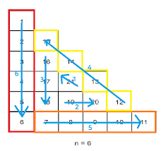

### 🔍 문제 링크
[Level2 **삼각 달팽이** 문제](https://school.programmers.co.kr/learn/courses/30/lessons/68645)

### 📘 문제 설명
정수 n이 매개변수로 주어집니다. 다음 그림과 같이 밑변의 길이와 높이가 n인 삼각형에서 맨 위 꼭짓점부터 반시계 방향으로 달팽이 채우기를 진행한 후, 첫 행부터 마지막 행까지 모두 순서대로 합친 새로운 배열을 return 하도록 solution 함수를 완성해주세요.


### 📕 제한사항
- n은 1 이상 1,000 이하입니다.

### 📙 입출력 예
|n|result|
|:---|:---|
|4|[1,2,9,3,10,8,4,5,6,7]|
|5|[1,2,12,3,13,11,4,14,15,10,5,6,7,8,9]|
|6|[1,2,15,3,16,14,4,17,21,13,5,18,19,20,12,6,7,8,9,10,11]|

### 📒 입출력 예 설명
**입출력 예 #1**  
문제 예시와 같습니다.

**입출력 예 #2**  
문제 예시와 같습니다.

**입출력 예 #3**  
문제 예시와 같습니다.

### 📔 나의 알고리즘 순서
1. 높이 n만큼 배열을 만들고, 배열의 길이는 높이와 같게 하여 각 요소를 0으로 초기화 한다.
2. 방향 플래그를 확인한다.  
  2-1. down: 행을 아래로 움직이며 숫자를 채운다.  
  2-2. flat: 한 행이 끝날 때까지 움직인다.  
  2-3. up: 행을 위로 움직이며 숫자를 채운다.  
3. 움직일 수 있는 횟수를 확인한다.  
  3-1. 움직일 수 있다면, 숫자를 채우고 방향 플래그에 따라 움직인다.  
  3-2. 움직일 수 없다면, 방향 플래그를 수정한다.  
4. 움직일 수 있는 횟수가 0이 될때까지 반복한다.

### ✅ 나의 해답코드
```javascript
function solution(n) {
  const DIRECTION_OPTION = Object.freeze({ DOWN: 0, FLAT: 1, UP: 2 });
  
  // 높이 n만큼 배열을 만들고, 각 배열의 길이는 높이와 같게 하며, 각 요소를 0으로 초기화
  const result = Array.from({ length: n }, (_, idx) => {
    return { store: Array(idx + 1).fill(0), left: 0, right: idx };
  });

  // 진행 방향, 최대 진행 가능 횟수, 현재 진행 횟수, 배열의 인덱스, 삽입할 값 초기화
  let direction = DIRECTION_OPTION.DOWN;
  let maxMove = n;
  let move = 0;
  let index = -1;
  let num = 1;

  // 최대 진행 가능 횟수가 0이 될 때까지 반복
  while (maxMove > 0) {
    // 방향에 따라 인덱스값을 수정하여, 데이터를 삽입
    if (direction === DIRECTION_OPTION.DOWN) {
      index++;
      const target = result[index];
      target.store[target.left++] = num;
    } else if (direction === DIRECTION_OPTION.FLAT) {
      const target = result[index];
      target.store[target.left++] = num;
    } else {
      index--;
      const target = result[index];
      target.store[target.right--] = num;
    }
    num++;
    move++;

    // 최대 진행 가능 횟수를 충족했다면, 방향을 변경하고 최대 진행수 차감
    if (maxMove === move) {
      direction = (direction + 1) % Object.keys(DIRECTION_OPTION).length;
      maxMove--;
      move = 0;
    }
  }

  return result.map((row) => row.store).flat();
}

```

### ✨ 깔끔한 해답코드
```javascript
function solution(n) {
  let a = Array(n).fill().map((_, i) => Array(i + 1).fill())
  let row = -1
  let col = 0
  let fill = 0
  for (let i = n; i > 0; i -= 3) {
    a[++row][col] = ++fill
    for (let j = 0; j < i - 1; j++) a[++row][col] = ++fill
    for (let j = 0; j < i - 1; j++) a[row][++col] = ++fill
    for (let j = 0; j < i - 2; j++) a[--row][--col] = ++fill
  }
  return a.flat()
}
```

### 🤔고민한점 & 💡배운점
1\) 🤔 문제를 읽고 찾은 규칙은 다음과 같다.

- 방향은 총 3가지이며, 순차적으로 변경된다. (아래, 오른쪽, 좌상단 순환)
- 처음엔 깊이 n만큼 이동할 수 있고, 방향이 전환될 때마다 이동 가능 횟수가 1씩 감소한다.



이를 바탕으로 이동 횟수를 기준으로 방향을 전환하고, 이동 가능 횟수가 0이 될 때까지 반복하도록 알고리즘을 설계했다. 

2\) 💡문제를 통과하고 다른 사람의 풀이를 참고하던 중 깔끔한 해답 코드를 발견했다. 기본적인 접근 방법은 유사하지만, 각 방향에 따라 인덱스를 어떻게 변경해야 하는지가 추가되어 있다. 2차원 배열로 생각하면 ROW와 COL을 아래와 같이 수정하면 각 방향에 맞춰 이동할 수 있다.

|방향|ROW|COL|
|:---|:---:|:---:|
|아래 (`↓`)|+1|-|
|오른쪽 (`→`)|-|+1|
|좌상단 (`↖`)|-1|-1|


사실 나는 문제를 풀이할 때 방향에 따른 인덱스 수정에 대해 생각하지 못했다. 내가 생각한 방법은 배열의 앞에서부터 채워야하는가, 뒤에서 채워야하는가에 대해서만 생각했고, 앞뒤 삽입 위치를 기억하기 위해 투포인터처럼 각 위치를 표기하는 방법을 사용하였다. (조금 더 생각해봤으면 문제를 복잡하지 풀지 않아도 되었을텐데...)

### 🔍참고 내용
1. [\[프로그래머스 - Java\] 삼각 달팽이](https://excited-hyun.tistory.com/203)