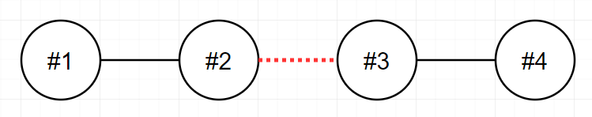
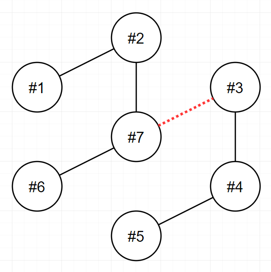

### 🔍 문제 링크
[Level2 **전력망 둘로 나누기** 문제](https://school.programmers.co.kr/learn/courses/30/lessons/86971)

### 📘 문제 설명
n개의 송전탑이 전선을 통해 하나의 트리 형태로 연결되어 있습니다. 당신은 이 전선들 중 하나를 끊어서 현재의 전력망 네트워크를 2개로 분할하려고 합니다. 이때, 두 전력망이 갖게 되는 송전탑의 개수를 최대한 비슷하게 맞추고자 합니다.

송전탑의 개수 n, 그리고 전선 정보 wires가 매개변수로 주어집니다. 전선들 중 하나를 끊어서 송전탑 개수가 가능한 비슷하도록 두 전력망으로 나누었을 때, 두 전력망이 가지고 있는 송전탑 개수의 차이(절대값)를 return 하도록 solution 함수를 완성해주세요.

### 📕 제한사항
- n은 2 이상 100 이하인 자연수입니다.
- wires는 길이가 `n-1`인 정수형 2차원 배열입니다.
  - wires의 각 원소는 [v1, v2] 2개의 자연수로 이루어져 있으며, 이는 전력망의 v1번 송전탑과 v2번 송전탑이 전선으로 연결되어 있다는 것을 의미합니다.
  - 1 ≤ v1 < v2 ≤ n 입니다.
  - 전력망 네트워크가 하나의 트리 형태가 아닌 경우는 입력으로 주어지지 않습니다.

### 📙 입출력 예
|n|wires|result|
|:---|:---|:---|
|9|[[1,3],[2,3],[3,4],[4,5],[4,6],[4,7],[7,8],[7,9]]|3|
|4|[[1,2],[2,3],[3,4]]|0|
|7|[[1,2],[2,7],[3,7],[3,4],[4,5],[6,7]]|1|

### 📒 입출력 예 설명
**입출력 예 #1**  
다음 그림은 주어진 입력을 해결하는 방법 중 하나를 나타낸 것입니다.


4번과 7번을 연결하는 전선을 끊으면 두 전력망은 각 6개와 3개의 송전탑을 가지며, 이보다 더 비슷한 개수로 전력망을 나눌 수 없습니다.
또 다른 방법으로는 3번과 4번을 연결하는 전선을 끊어도 최선의 정답을 도출할 수 있습니다.

**입출력 예 #2**  
다음 그림은 주어진 입력을 해결하는 방법을 나타낸 것입니다.



2번과 3번을 연결하는 전선을 끊으면 두 전력망이 모두 2개의 송전탑을 가지게 되며, 이 방법이 최선입니다.

**입출력 예 #3**  
다음 그림은 주어진 입력을 해결하는 방법을 나타낸 것입니다.



3번과 7번을 연결하는 전선을 끊으면 두 전력망이 각각 4개와 3개의 송전탑을 가지게 되며, 이 방법이 최선입니다.

### 📔 나의 알고리즘 순서
1. 그래프를 정리한다.  
2. 간선을 하나씩 선택하여 분리된 노드를 기준으로 완전 탐색을 진행해 연결된 노드를 배열로 구한다.  
3. 하나라도 겹치는 노드가 있는가 확인한다.  
  3-1. 겹치지 않으면 두 네트워크 망의 노드 개수의 차를 구해 최소값인지 확인한다.  
  3-2. 겹치면 나눠진게 아니니 무시한다.  

### ✅ 나의 해답코드
```javascript
function solution(n, wires) {
  const graph = Array.from({ length: n + 1 }, () => []);
  wires.forEach((wire) => {
    const [start, end] = wire;
    graph[start].push(end);
    graph[end].push(start);
  });

  const dfs = (target, exclude) => {
    const result = [];
    const visited = Array(n).fill(0);
    const stack = [target];
    while (stack.length) {
      const target = stack.pop();
      visited[target] = 1;
      result.push(target);

      const nextList = graph[target];
      nextList.forEach((next) => {
        if (!visited[next] && exclude !== next) {
          stack.push(next);
        }
      });
    }
    return result.length;
  };

  let minDiff = Infinity;
  wires.forEach((wire) => {
    const [n1, n2] = wire;
    const result1 = dfs(n1, n2);
    const result2 = dfs(n2, n1);

    const diff = Math.abs(result1 - result2);
    if (minDiff > diff) minDiff = diff;
  });

  return minDiff;
}
```

### 📝고민한점 & 💡배운점
1\) 🤔 문제를 읽고 2~3분 동안 어떻게 하면 간선을 자른 후에 두 네트워크망의 노드의 수를 계산하여 제일 유사한 크기로 자를까 고민했다. 결과적으로는 연결된 간선을 하나씩 골라서 자르고, 간선으로 연결되어 있던 2개의 노드를 기준으로 완전 탐색(DFS/BFS)을 진행하여 노드의 개수의 차이를 비교하는 방법이 떠올랐다.

방법이 떠오르니 다음으로 궁금해진게, 간선을 자른다고 정말 완벽하게 두 개의 네트워크 망으로 끊어질까였다. 처음에는 간선을 골라 자른 후, 연결되었던 2개의 노드를 기준으로 탐색한 노드를 기준으로 1개라도 겹치는게 있다면 연결된 것이라 간주해야하나 생각했다. 그러다 문제의 제약 사항에 트리구조에 wires가 `n-1`개라는 조건을 보고 어디를 자르든 완벽하게 분할되겠구나 생각하게 되었다.

2\) 🤔 그래프를 초기화할 때 `n`개가 아니라 `n+1`로 초기화한 이유는 wire 번호가 1부터 시작하기 때문에 편의성을 위해 더미를 추가한 것이다. 어차피 0번째에 있는 데이터는 간선으로 연결되지 않아 고려되지 않는 데이터가 된다.

3\) 💡Array.from 메서드를 이용하면 배열의 길이와 초기값을 정할 수 있어서 정말 편하다.

```js
const graph = Array.from({length: n+1}, () => []);
wires.forEach(wire => {
  const [start, end] = wire;
  graph[start].push(end);
  graph[end].push(start);
});
```

만약 Array.from을 사용하지 않았다면 매번 객체 안에 key가 있는지부터 확인하여 별도의 초기화 과정을 거쳐야했을 것이다.

```js
const graph = [];
wires.forEach(wire => {
  const [start, end] = wire;
  if(!graph[start]) graph[start] = [];
  if(!graph[end]) graph[end] = [];
  graph[start].push(end);
  graph[end].push(start);
});
```
