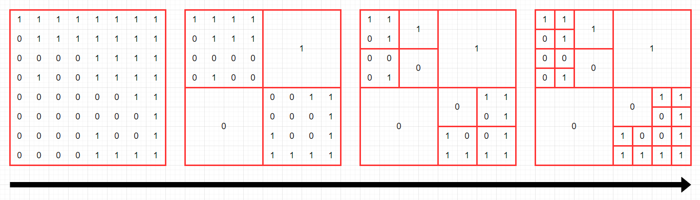

### 🔍 문제 링크
[Level2 **쿼드압축 후 개수 세기** 문제](https://school.programmers.co.kr/learn/courses/30/lessons/68936)

### 📘 문제 설명
0과 1로 이루어진 2n x 2n 크기의 2차원 정수 배열 arr이 있습니다. 당신은 이 arr을 [쿼드 트리](https://en.wikipedia.org/wiki/Quadtree)와 같은 방식으로 압축하고자 합니다. 구체적인 방식은 다음과 같습니다.

1. 당신이 압축하고자 하는 특정 영역을 S라고 정의합니다.
2. 만약 S 내부에 있는 모든 수가 같은 값이라면, S를 해당 수 하나로 압축시킵니다.
3. 그렇지 않다면, S를 정확히 4개의 균일한 정사각형 영역(입출력 예를 참고해주시기 바랍니다.)으로 쪼갠 뒤, 각 정사각형 영역에 대해 같은 방식의 압축을 시도합니다.
arr이 매개변수로 주어집니다. 위와 같은 방식으로 arr을 압축했을 때, 배열에 최종적으로 남는 0의 개수와 1의 개수를 배열에 담아서 return 하도록 solution 함수를 완성해주세요.

### 📕 제한사항
- arr의 행의 개수는 1 이상 1024 이하이며, 2의 거듭 제곱수 형태를 하고 있습니다. 즉, arr의 행의 개수는 1, 2, 4, 8, ..., 1024 중 하나입니다.
  - arr의 각 행의 길이는 arr의 행의 개수와 같습니다. 즉, arr은 정사각형 배열입니다.
  - arr의 각 행에 있는 모든 값은 0 또는 1 입니다.

### 📙 입출력 예
|arr|result|
|:---|:---|
|[[1,1,0,0],[1,0,0,0],[1,0,0,1],[1,1,1,1]]|[4,9]|
|[[1,1,1,1,1,1,1,1],[0,1,1,1,1,1,1,1],[0,0,0,0,1,1,1,1],[0,1,0,0,1,1,1,1],[0,0,0,0,0,0,1,1],[0,0,0,0,0,0,0,1],[0,0,0,0,1,0,0,1],[0,0,0,0,1,1,1,1]]|[10,15]|

### 📒 입출력 예 설명
**입출력 예 #1**  
다음 그림은 주어진 arr을 압축하는 과정을 나타낸 것입니다.


최종 압축 결과에 0이 4개, 1이 9개 있으므로, `[4,9]`를 return 해야 합니다.

**입출력 예 #2**  
다음 그림은 주어진 arr을 압축하는 과정을 나타낸 것입니다.



최종 압축 결과에 0이 10개, 1이 15개 있으므로, `[10,15]`를 return 해야 합니다.

### 📔 나의 알고리즘 순서
1. 전체 배열을 기준(S)으로 쿼드 압축을 실행한다.  
  1-1. S 내부의 모든 수가 같다면, 하나의 수로 압축  
  1-2. S 내부의 수가 다르다면, 정확히 4등분하여 1번부터 다시 실행
2. 모든 압축이 끝난 후 0과 1의 개수를 담은 배열을 반환한다.

### ✅ 나의 해답코드
```javascript
function solution(arr) {
  const answer = [0, 0];
  const quadCompact = (row, col, len) => {
    const value = arr[row][col];

    // 1x1의 사각형은 더이상 확인할 필요없으니 조기종료
    if (len === 1) return (answer[value] += 1);

    // 사각형 범위 안의 숫자를 추출한다.
    const numbers = [];
    for (let i = row; i < row + len; i++) {
      for (let j = col; j < col + len; j++) {
        numbers.push(arr[i][j]);
      }
    }

    // 모두 같은 숫자라면, 하나의 숫자로 압축하고 종료한다.
    if (numbers.every((v) => v === value)) return (answer[value] += 1);

    // 하나라도 다르다면, 균일한 사각형으로 나눠서 다시 압축을 실행한다.
    const half = len / 2;
    quadCompact(row, col, half);
    quadCompact(row, col + half, half);
    quadCompact(row + half, col, half);
    quadCompact(row + half, col + half, half);
  };
  quadCompact(0, 0, arr.length);

  return answer;
}
```

### 🤔고민한점 & 💡배운점
1\) 🤔 이번 문제는 쿼드 압축을 위한 알고리즘 순서를 제공해주고 있다. 때문에 압축의 대상이 되는 배열에게 쿼드 압축을 위한 알고리즘을 어떻게 제공해줄지만 정하면 됐다.

2차원 배열을 동일한 크기의 정사각형으로 잘라서 쿼드 압축을 실행해야 하므로, 2차원 배열의 범위를 특정하는 방법이 필요했고, 이를 시작점이 되는 row와 col을 받아오고, 이들의 길이 len을 받음으로써 범위를 제한하도록 했다.

쿼드 압축을 위해 확인할 범위가 1x1의 크기의 사각형일 때엔 원소가 1개이므로 쿼드 압축을 할 필요가 없다. 이런 경우엔 조기 반환하도록 만들었다.

1x1 크기 이상의 사각형의 경우 쿼드 압축을 진행하고, 모든 숫자가 같다면 쿼드 압축이 성공하여 하나의 숫자로 압축하여 개수를 카운팅하고 종료한다. 하나라도 숫자가 다르다면 균일한 크기로 잘라, 새로운 범위를 기준으로 다시 쿼드 압축을 진행하도록 만들었다.