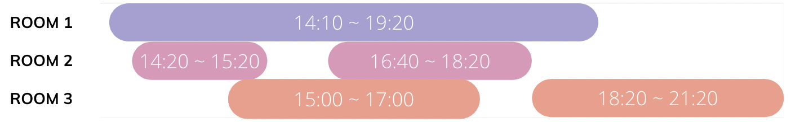

### 🔍 문제 링크
[Level2 **호텔 대실** 문제](https://school.programmers.co.kr/learn/courses/30/lessons/155651)

### 📘 문제 설명
호텔을 운영 중인 코니는 최소한의 객실만을 사용하여 예약 손님들을 받으려고 합니다. 한 번 사용한 객실은 퇴실 시간을 기준으로 10분간 청소를 하고 다음 손님들이 사용할 수 있습니다.
예약 시각이 문자열 형태로 담긴 2차원 배열 `book_time`이 매개변수로 주어질 때, 코니에게 필요한 최소 객실의 수를 return 하는 solution 함수를 완성해주세요.

### 📕 제한사항
- 1 ≤ `book_time`의 길이 ≤ 1,000
  - `book_time[i]`는 ["HH:MM", "HH:MM"]의 형태로 이루어진 배열입니다
    - [대실 시작 시각, 대실 종료 시각] 형태입니다.
  - 시각은 HH:MM 형태로 24시간 표기법을 따르며, "00:00" 부터 "23:59" 까지로 주어집니다.
    - 예약 시각이 자정을 넘어가는 경우는 없습니다.
    - 시작 시각은 항상 종료 시각보다 빠릅니다.

### 📙 입출력 예
|book_time|result|
|:---|:---|
|[["15:00", "17:00"], ["16:40", "18:20"], ["14:20", "15:20"], ["14:10", "19:20"], ["18:20", "21:20"]]|3|
|[["09:10", "10:10"], ["10:20", "12:20"]]|1|
|[["10:20", "12:30"], ["10:20", "12:30"], ["10:20", "12:30"]]|3|

### 📒 입출력 예 설명
**입출력 예 #1**  

위 사진과 같습니다.

**입출력 예 #2**  \
첫 번째 손님이 10시 10분에 퇴실 후 10분간 청소한 뒤 두 번째 손님이 10시 20분에 입실하여 사용할 수 있으므로 방은 1개만 필요합니다.

**입출력 예 #3**  
세 손님 모두 동일한 시간대를 예약했기 때문에 3개의 방이 필요합니다.

### 📔 나의 알고리즘 순서
1. 입실시간, 퇴실시간을 분류하고, 분 단위로 치환한다.
2. 시간을 기준으로 오름차순으로 정렬한다. 만약 시간이 같다면 체크아웃이 앞선다.
3. 각 유형에 따라 순차적으로 처리하며 최소 객실을 구한다.

### ✅ 나의 해답코드
```javascript
function solution(book_time) {
  let answer = 0;
  const convertTimeToMinute = (time) => {
    const [hour, minute] = time.split(':').map(Number);
    return hour * 60 + minute;
  };

  const logs = [];
  book_time.forEach((timeLog) => {
    const [checkIn, checkOut] = timeLog.map((time) => convertTimeToMinute(time));
    logs.push(['in', checkIn]);
    logs.push(['out', checkOut + 10]);
  });
  logs.sort((a, b) => {
    if (a[1] === b[1]) return a[0] > b[0] ? -1 : 1;
    return a[1] - b[1];
  });

  let room = 0;
  logs.forEach((log) => {
    const [type, time] = log;
    if (type === 'in') !room ? (answer += 1) : (room -= 1);
    else if (type === 'out') room += 1;
  });

  return answer;
}
```

### ✨ 깔끔한 해답코드
```javascript
function makeMinStamp(time) {
    const [hour, min] = time.split(":").map(v => Number(v));
    return hour * 60 + min;
}

function solution(book_time) {
    const timeArr = Array.from({ length: makeMinStamp('23:59') + 10 }, () => 0);

    book_time.forEach((time, i) => {
        const [s, e] = time;
        let start = makeMinStamp(s);
        const end = makeMinStamp(e) + 9;

        for (start; start <= end; start++) {
            timeArr[start]++;
        }
    });

    return Math.max(...timeArr);
}
```
구간합(prefix sum)을 이용한 멋진 풀이다. 입실 시간부터 퇴실 이후 청소시간까지 어차피 방은 할당되어 사용되고 있다. 그러니 입실 시간부터 청소시간에 해당하는 구간 전부에 +1을 하여 방이 배정되었음을 표기한다. 이를 모든 대실 현황을 가져와서 구간에 적용하면, 시간별 최대 필요한 방이 나올 것이다. 이 최대값이 최소한으로 필요한 방이 된다.

### 🤔고민한점 & 💡배운점
1\) 🤔 문제를 읽고 입실 시간과 퇴실 시간을 정렬하여 순차적으로 처리하면 된다고 생각했다. 정렬의 기준을 세우기 위해 먼저 시간을 모두 분으로 치환했다. 이후 분을 기준으로 정렬을 진행하는데, 입실과 퇴실을 구별하기 위해서 `in`, `out`을 별도로 표시하도록 만들었다. 만약 입실, 퇴실 시간이 같다면 방을 확보하기 위해 `out`을 먼저 처리할 수 있도록 더 앞으로 정렬한다.

정렬이 끝난 뒤, 입퇴실 기록을 하나씩 가져오면서 기존의 방을 배정하거나 부족하면 새로운 방을 추가하는 방식으로 누적된 방의 개수를 찾았다.

2\) 💡문제를 다 풀고 다른 사람들의 풀이를 보면서 다양한 방법이 있음을 알게 되었다. 최소힙을 이용하여 입실과 퇴실의 로그를 하나씩 꺼내와서 처리하는 방법도 있고, 구간합을 이용하여 풀이하는 방법도 있었다. 타임스탬프를 기준으로 생각할 때, 특정 범위의 대실 현황을 고려해야한다는 점이 구간합 알고리즘에 제일 적절하지 않을까 생각했다.

### 🔍참고 내용
1.🌟 [\[AlgoDale\] 호텔 대실](https://www.algodale.com/problems/%ED%98%B8%ED%85%94-%EB%8C%80%EC%8B%A4/)  
2. [\[공병 개발자의 삽질\] 호텔 대실(JAVA)](https://ksb-dev.tistory.com/269)