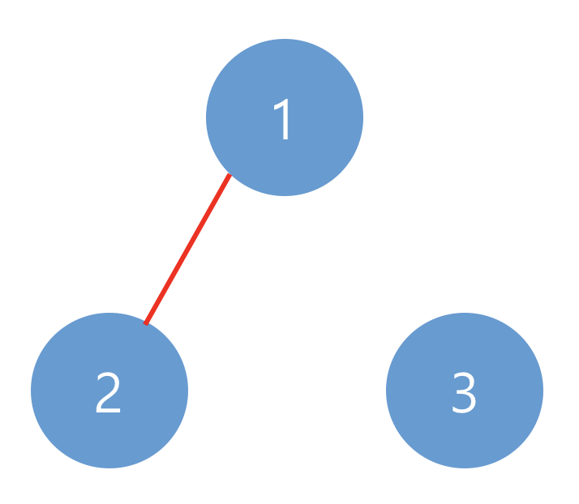

### 🔍 문제 링크
[Level3 **네트워크** 문제](https://school.programmers.co.kr/learn/courses/30/lessons/43162)

### 📘 문제 설명
네트워크란 컴퓨터 상호 간에 정보를 교환할 수 있도록 연결된 형태를 의미합니다. 예를 들어, 컴퓨터 A와 컴퓨터 B가 직접적으로 연결되어있고, 컴퓨터 B와 컴퓨터 C가 직접적으로 연결되어 있을 때 컴퓨터 A와 컴퓨터 C도 간접적으로 연결되어 정보를 교환할 수 있습니다. 따라서 컴퓨터 A, B, C는 모두 같은 네트워크 상에 있다고 할 수 있습니다.

컴퓨터의 개수 n, 연결에 대한 정보가 담긴 2차원 배열 computers가 매개변수로 주어질 때, 네트워크의 개수를 return 하도록 solution 함수를 작성하시오.

### 📕 제한사항
- 컴퓨터의 개수 n은 1 이상 200 이하인 자연수입니다.
- 각 컴퓨터는 0부터 `n-1`인 정수로 표현합니다.
- i번 컴퓨터와 j번 컴퓨터가 연결되어 있으면 computers[i][j]를 1로 표현합니다.
- computer[i][i]는 항상 1입니다.
### 📙 입출력 예
|n|computers|return|
|:---|:---|:---|
|3|[[1, 1, 0], [1, 1, 0], [0, 0, 1]]|2|
|3|[[1, 1, 0], [1, 1, 1], [0, 1, 1]]|1|

### 📒 입출력 예 설명
**예제 #1**  
아래와 같이 2개의 네트워크가 있습니다.


**예제 #2**  
아래와 같이 1개의 네트워크가 있습니다.


### 📔 나의 알고리즘 순서
1) 순차적으로 컴퓨터가 연결되었는지 확인한다.
2) 연결된 컴퓨터를 발견했다면, 해당 네트워크와 연결된 컴퓨터를 다 탐색하고, 네트워크 개수를 증가시킨다.
3) 전체적인 확인이 끝날 때까지 2번을 1~2번을 반복한다.

### ✅ 나의 해답코드
```javascript
function solution(n, computers) {
  let answer = 0;

  const findConnectedComputer = (start) => {
    const next = [start];
    while (next.length) {
      const size = next.length;
      for (let i = 0; i < size; i++) {
        const [start, end] = next.shift();
        computers[start][end] = 0;
        computers[end][start] = 0;

        for (let j = 0; j < n; j++) {
          if (computers[end][j] === 1) {
            next.push([end, j]);
          }
        }
      }
    }
  };

  for (let i = 0; i < n; i++) {
    for (let j = 0; j < n; j++) {
      if (computers[i][j] === 1) {
        findConnectedComputer([i, j]);
        answer += 1;
      }
    }
  }

  return answer;
}
```

### ✨ 깔끔한 해답코드
```javascript
function solution(n, computers) {
  let answer = 0;
  const visited = Array.from({ length: n }, () => false);

  function dfs(index) {
    visited[index] = true;

    for (let i = 0; i < computers.length; i++) {
      if (computers[index][i] && !visited[i]) {
        dfs(i);
      }
    }
  }

  for (let i = 0; i < computers.length; i++) {
    if (!visited[i]) {
      dfs(i);
      answer++;
    }
  }

  return answer;
}
```

다른 사람 풀이를 보다가 아차 싶었던 코드이다. 나의 알고리즘은 직접 연결된 컴퓨터들을 하나하나 탐색하면서 방문처리를 하는 풀이라면, 위의 코드는 어차피 하나의 컴퓨터에 접근하면 연결 가능한 컴퓨터들은 모두 방문할텐데 하나하나 확인하기 보다 해당 컴퓨터 자체를 방문처리를 하는 방법이었다. 그러면 연결된 모든 컴퓨터들이 방문처리가 되면서, 자연스럽게 아직 네트워크로 연결되지 않는 컴퓨터들이 걸러진다. 이 방법을 반복하면 더 쉽고 빠르게 독립된 네트워크 개수를 구할 수 있다.


### 📝고민한점 & 💡배운점
1\) 🤔 컴퓨터들이 네트워크에 연결되있는걸 어떻게 확인해야할까 고민되었습니다. 독립적인 네트워크를 확인하기 위해서 기준 컴퓨터를 잡고 연결 가능한 모든 장치에 접근해야한다고 생각했고 이때 필요한 개념이 DFS/BFS 라고 생각했습니다. 이번 문제는 네트워크에 연결된 전체 컴퓨터를 확인해야하니 BFS처럼 풀어도 괜찮겠다 생각했고, 최종적으로는 queue를 이용한 BFS로 풀이했습니다.